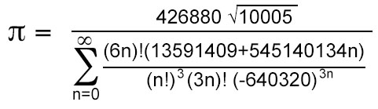

# 5 Days to go ...

## Read file [HISTORY.md](../master/HISTORY.md) to follow progress to date.

## The calculation of pi is being debugged, few more days please...

The start date was Feb 14, 2021. Time needed is 1 month.
The goal is to write ARM64 program to calculate pi, on a Raspberry Pi, by "Pi Day" March 14.

In order use a Raspberry Pi in 64-Bit mode, the new beta
version Raspberry OS 64 bit is required.

This is what I am using:

- Raspberry Pi 4 Model B Rev 1.2
- ARM64 (Beta) Debian GNU/Linux 10 (buster)
- https://downloads.raspberrypi.org/raspios_lite_arm64/images/raspios_lite_arm64-2020-08-24/
- GNU Assembler + GNU linker with arch=armv8-a and cpu=cortex-a72
- Editor: Atom 1.48 with package: Language-arm v2.1.1
- Editor settings: tab size 8 with hard tabs

## Installation

```
git clone git@github.com:cotarr/calc-pi-arm64-asm.git
cd calc-pi-arm64-asm
cd src
make

# to run from within the src folder
./calc-pi

```

## Commands available:

```
+ - * / . c.e c.pi c.pi.ch chs clrstk clrx
cmdlist D.vars D.fill D.ofst enter exit help
hex log logoff mmode prac print q recip
quit rcl rdown rup sf sigfigs sqrt sto
test version xy
```

## Example - Calculate pi to 1000 digits

The following commands:

- `sigfigs 1000` will set accuracy to 1000 digits in base 10
- `c.pi` will calculate pi
- `print f` will print the number in page formated layout

```
(Elapsed: 0.000 Sec) Op Code: sigfigs 1000

Accuracy: 1000 Digits (fraction part)

(Elapsed: 0.000 Sec) Op Code: c.pi    

Function_calc_e: Calculating pi using Chudnovsky Formul

XREG   +3.14159265358979323846264338327950288419716939937510
YREG   +0.0
ZREG   +0.0
TREG   +0.0

(Elapsed: 0.008 Sec) Op Code: print f

+3.
1415926535 8979323846 2643383279 5028841971 6939937510 5820974944 5923078164 0628620899 8628034825 3421170679
8214808651 3282306647 0938446095 5058223172 5359408128 4811174502 8410270193 8521105559 6446229489 5493038196
4428810975 6659334461 2847564823 3786783165 2712019091 4564856692 3460348610 4543266482 1339360726 0249141273
7245870066 0631558817 4881520920 9628292540 9171536436 7892590360 0113305305 4882046652 1384146951 9415116094
3305727036 5759591953 0921861173 8193261179 3105118548 0744623799 6274956735 1885752724 8912279381 8301194912
9833673362 4406566430 8602139494 6395224737 1907021798 6094370277 0539217176 2931767523 8467481846 7669405132
0005681271 4526356082 7785771342 7577896091 7363717872 1468440901 2249534301 4654958537 1050792279 6892589235
4201995611 2129021960 8640344181 5981362977 4771309960 5187072113 4999999837 2978049951 0597317328 1609631859
5024459455 3469083026 4252230825 3344685035 2619311881 7101000313 7838752886 5875332083 8142061717 7669147303
5982534904 2875546873 1159562863 8823537875 9375195778 1857780532 1712268066 1300192787 6611195909 2164201989
(3809525720 )

(Elapsed: 0.008 Sec) Op Code:
```


## Update 2021-03-08 (See [HISTORY.md](../master/HISTORY.md)).

The core arithmetic functions are now working. This includes
addition, subtraction, multiplication, and division.

In this state, the program basically works like an RPN calculator.
Numbers may be input followed by the [enter] key. The
"*", "/", "+", and "-" operators will invoke the arithmetic
functions. Pressing a period will print the X-Register.

My first attempt at calculating pi has been coded. I am currently
debugging it, but it's moving forward. The calculation uses
the Chudnovsky formula.

I plan to get more documentation together after I finish debugging
the code.

## Chudnovsky Formula



## First benchmark 2021-03-08 Calculation of pi

```
   Digits   Seconds
    10000     1.049
    20000     4.820
    40000    23.344
   100000    77.266
   200000   321.775
```

### Security Note

This application was intended for I/O limited to local keyboard and console output
within a Linux command line shell. This calculation includes a rather ubiquitous
use of memory pointers that have not been reviewed for safe pointer practices.
Therefore, modification of the program to service a direct internet connection
is not recommended.

System memory used for floating point number variables are defined in
math.s using statements to declare uninitialized blocks of memory
in the BSS section. These are statically allocated when the program is
started as part of the load image. No memory is dynamically allocated.

All input and output is performed using ARM64 `svc` system call statements.
All I/O functions are located in the "io_module.asm" file.
They are used to accept keyboard input, produce console output, capture
program text output to a disk file, and read the system clock.

There are no dependencies on third party libraries.
